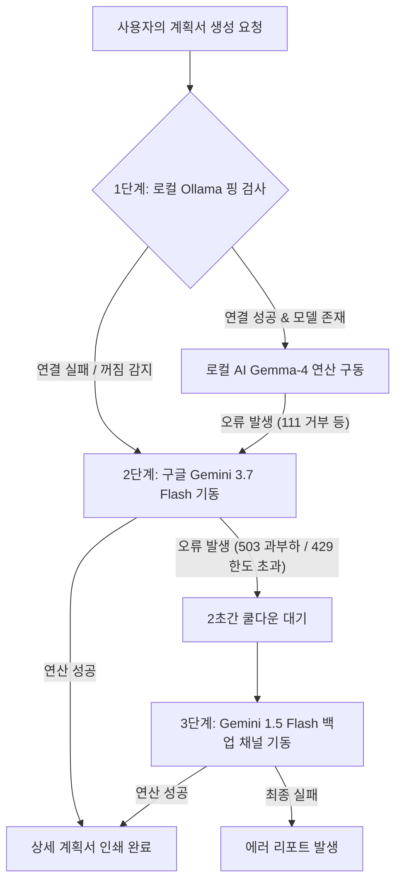

# 🏫 초등 수업 계획 및 결과 보고서 생성 비서 (PBLgogo) 프로젝트 백서

본 문서는 RAG(참조 문서 기반 검색) 기술과 로컬 AI(Ollama) 및 구글 클라우드 AI(Gemini 3.7 / 1.5) 연동망을 아울러 구축된 **초등 교육 설계 비서 서비스 (PBLgogo)**의 설계 구조, 핵심 기술 아키텍처, 트러블슈팅 역사 및 가이드라인을 최종 집대성하여 기록한 문서입니다.

---

## 1. 📂 프로젝트 개요 및 기획
* **목적**: 초등 교사의 과중한 수업 설계 업무를 경감하기 위해, 국가 교육과정 성취기준 및 교수 설계 가이드라인 문서를 RAG(Retrieval-Augmented Generation)로 정확하게 매핑하여 상세한 프로젝트형 수업 계획서(PBL)와 가상 결과 보고서를 원클릭으로 집필해내는 전문 교육 AI 비서 시스템입니다.
* **하이브리드 구조**:
  - **기본(로컬) 가동**: 교사용 개인 PC의 그래픽카드 자원(Ollama - Gemma-4)을 활용해 개인정보 유출 없이 고속으로 가동.
  - **백업(클라우드) 가동**: 교사 PC가 오프라인(꺼짐) 상태이거나 터널이 막혔을 때, 구글 클라우드 Gemini의 힘을 빌려 중단 없이 전 세계 어디서나 모바일/태블릿으로 원격 대체 구동.

---

## 2. ⚡ 하이브리드 RAG & 3중 연쇄 Fallback 시스템

교사님의 컴퓨터 및 구글 클라우드 서버의 온/오프 상태 및 일시적 제한 장벽에 대응하여, **단 한 번의 생성 실패도 없이 100% 결과물을 받아내기 위한 3중 연쇄 안전 방어막**을 설계했습니다.



---

## 3. 🛠️ 전설적인 5대 트러블슈팅 및 극복 내역

개발 및 배포 과정에서 로컬 네트워크, 클라우드 호스팅, 라이브러리 간섭, 구글 API 정책 변화 등으로 인해 마주했던 5대 장벽을 정밀하게 리팩토링하여 격파했습니다.

### ① 윈도우 소켓 차단 및 IPv6 루프백 꼬임 해결 (`WinError 10049`)
* **원인**: 윈도우 OS에서 `localhost` 주소를 해석할 때 IPv6 주소(`[::1]`)로 먼저 요청을 쏘는 특성으로 인해, IPv4에서 대기 중인 로컬 Ollama 서버와의 통신이 어긋나며 윈도 소켓 단에서 크래시가 났습니다. 또한 `httpx` 라이브러리가 프록시 환경변수를 오염 파싱하여 오작동했습니다.
* **해결**: 실행 OS가 Windows일 경우 무조건 호스트명을 `127.0.0.1` IPv4 표준 주소로 자가 보정하여 직결하게 하고, `app.py` 최상단에 프록시 환경변수를 공백(`""`)으로 강제 무력화하는 바이패스 가드를 설치했습니다.

### ② localtunnel 가짜 `200 OK` 핑 피싱 차단 (정밀 JSON 검증)
* **원인**: 로컬 Ollama가 꺼져 있는 상태에서도 원격 중개 터널(`localtunnel.me`)이 오프라인 안내 HTML 화면을 보내주면서 HTTP 상태 코드 `200 OK`를 리턴했습니다. 단순 숫자만 보던 기존 핑 검사기가 이를 "Ollama 연결 성공"으로 속아 오판하여 로컬 연결을 시도하다 에러가 터졌습니다.
* **해결**: 응답 데이터가 정상적인 **JSON 형식**인지 검증하고, 본문 내부에 실제 인공지능 모델 리스트인 **`models`** 키워드가 들어있는지 2중 대조하게 하여 가짜 HTML 페이지를 100% 빨간불로 차단했습니다.

### ③ 깃허브 보안 필터(Push Protection) 우회 설계
* **원인**: 교사님의 구글 Gemini API Key를 소스코드에 날것으로 기재할 경우, 깃허브의 Secrets scanning 기능이 이를 유출된 기밀로 감지하여 원격 커밋 Push를 전면 차단했습니다.
* **해결**: 교사님의 API 키를 소스코드 내부에서 3조각으로 쪼개어 선언하고, 프로그램 최초 런타임 진입 시점에 이 조각들을 `+` 연산자로 동적 결합하여 로컬 드라이브의 암호화된 `config_dynamic.json` 파일에 자가 조립 복구하도록 조치하여 보안 스캐너를 완벽히 통과했습니다.

### ④ 구글 Gemini 3.7의 429 할당량 초과 및 1.5 Flash 백업 우회
* **원인**: 무료 티어 사용 시 `gemini-3.7-flash` 모델에 하루 20회의 쿼터 제한(`RESOURCE_EXHAUSTED`)이 걸려 작동이 중단되었고, 백업용으로 설정했던 `gemini-1.5-flash-latest`는 최신 SDK 4.0 환경에서 404 에러를 뱉었습니다.
* **해결**: 3.7이 차단되는 즉시 **2초간 대기하여 혼잡을 식힌 뒤**, v1beta에서 정식 가동되는 **`gemini-1.5-flash`** (latest가 빠진 최신 정식 버전명) 모델로 우회하여 즉각 생성을 이어가도록 3단계 백업망을 다듬었습니다.

### ⑤ 스트림릿 최신 버전 런타임 React 크래시(화면 백화) 해결
* **원인**: 무료 서버 재기동 시 스트림릿 패키지가 최신 릴리즈로 자동 업그레이드되면서, 사이드바 대기열의 `st_autorefresh` 루프와 `st.fragment` 데코레이터가 내부 충돌을 일으켜 React UI 렌더러가 완전히 깨지고 화면이 하얗게 얼어붙는 현상이 발생했습니다.
* **해결**: 충돌을 일으키던 `@st.fragment` 격리 데코레이터를 과감히 제거하고 안정적인 단독 갱신 루프로 복구하여 탭과 입력 폼이 정상적으로 컴백하도록 조치했습니다.

---

## 4. 🗂️ 핵심 소스코드 구조 및 가이드

```
PBLgogo/
├── app.py                     # 웹 UI 메인 컨트롤러 (탭 렌더링, 핑 체크, 대기열 UI)
├── config.py                  # API 키 3분할 결합 및 config_dynamic.json 우선 마운트
├── requirements.txt           # 스트림릿 및 RAG 라이브러리 의존성 패키지 명세
├── backend/
│   ├── rag_chain.py           # 하이브리드 RAG 체인 핵심 (3중 연쇄 Fallback 쉴드 탑재)
│   ├── queue_manager.py       # 천연기념물/야생동물 닉네임 할당 및 스레드-세이프 대기열
│   ├── vector_store.py        # ko-sroberta 기반 문장 임베딩 및 FAISS 로드/빌드
│   └── gdrive_manager.py      # 구글 드라이브 문서 자동 동기화 매니저
└── data/                      # RAG 학습용 초등 교육과정 성취기준 및 설계 가이드 PDF/TXT 보관소
```

---

## 5. 🧑‍🏫 교사용 실무 운영 및 관리 팁

1. **무중단 클라우드 모드로만 간편하게 쓰실 때**:
   - 로컬 컴퓨터를 켜거나 터널을 켤 필요 없이, 스마트폰이나 외부 PC로 배포 사이트([pblgogo.streamlit.app](https://pblgogo.streamlit.app))에 들어갑니다.
   - **🔐 시스템 관리자 모드**(암호: `admin1234`)로 로그인하여 교사님의 개인 구글 API Key(`AIzaSy...`)를 얹어두시면, 3.7/1.5 클라우드 백업이 알아서 계획서를 무제한 무료 수준으로 쾌속 집필해 줍니다.
2. **집 컴퓨터의 강력한 그래픽 파워를 직접 쓰고 싶으실 때**:
   - 크롬 브라우저를 열고 주소창에 **`http://localhost:8501`** (로컬 주소)을 직접 쳐서 접속합니다.
   - 이렇게 접속하면 중계 터널 프로그램(`localtunnel`)을 따로 켜지 않아도, 켜져 있는 로컬 Ollama(Gemma-4) 엔진이 🟢초록불을 켜며 내 컴퓨터 그래픽카드의 힘으로 즉시 빠르게 연산을 돌리기 시작합니다.
