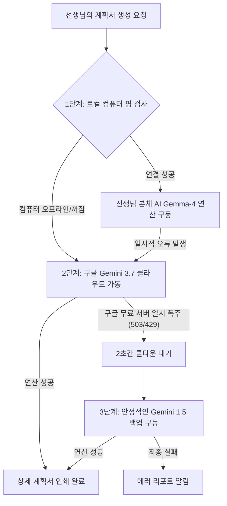

# 🏫 초등 수업 계획 및 결과 보고서 생성 비서 (PBLgogo) 프로젝트 백서

> **"매일 밤 교실에 홀로 남아 성취기준을 뒤적이며 지도안을 짜느라 늦게 퇴근하시는 동료 선생님들이, 단 5분 만에 수업 준비를 마치고 조금이라도 일찍 가족의 품으로 돌아가 쉴 수 있기를 바라는 마음으로 이 다리를 놓았습니다."**

---

## 💌 동료 선생님들께 드리는 따뜻한 서문
본 프로그램은 어떤 거창한 학술 명예나 기술적 증명을 얻기 위해 만들어진 것이 아닙니다. 
하루하루 아이들과 씨름하며 행정 업무와 수업 준비의 무거운 짐을 지고 계시는 **동료 교사 선생님들의 손과 발이 되어 실질적인 도움을 나누고자** 기획되었습니다. 

인공지능이 낯설고 컴퓨터 사양이 낮아도 상관없습니다. 선생님들이 교실 현장에서 겪는 고충을 해결하고, 매주 돌아오는 수업 설계 시간을 더 가볍고 행복하게 만들어 드리기 위한 진심을 이 문서와 프로그램에 온전히 담았습니다.

---

## 💡 선생님들을 위한 '막힘 해결' 3초 핵심 매뉴얼

프로그램을 사용하시다가 혹시 막히는 부분이 생기면 당황하지 마시고 아래의 해결책을 3초만 읽어보세요!

### 1. 화면이 갑자기 멈추거나 하얗게 백지 상태가 되었을 때 
* **원인**: 무료 클라우드 서버가 자원을 절약하기 위해 일시적으로 잠을 자거나(Sleep) 재기동 중인 상태입니다.
* **해결**: **30초~1분 뒤에 인터넷 창을 새로고침(F5)**해 주시면 본래의 예쁜 입력 폼들이 즉시 다시 나타납니다.

### 2. 집 컴퓨터를 완전히 끄고 외출했을 때 (스마트폰이나 태블릿으로 쓸 때)
* **원인**: 집에 있는 AI 본체 컴퓨터가 꺼져 있으면 로컬 AI가 응답하지 않습니다.
* **해결**: 인터넷 배포 사이트의 왼쪽 아래 **`🔐 시스템 관리자 모드`**(인증 암호: `admin1234`)로 들어가서 선생님의 **Gemini API Key**를 입력해 줍니다. 
* **결과**: 집 컴퓨터가 꺼져 있어도 구글의 클라우드 인공지능(Gemini)이 다이렉트로 가동되어, 전 세계 어디서나 스마트폰으로 무중단 생성을 해줍니다.

### 3. 집 컴퓨터 본체로 직접 켜서 더 빠르게 쓰고 싶을 때
* **원인**: 인터넷 배포 사이트 주소(`pblgogo.streamlit.app`)로 접속하면 중간 연결 터널을 거쳐야 해서 느리거나 끊길 수 있습니다.
* **해결**: 크롬 브라우저를 열고 주소창에 인터넷 주소 대신 **`http://localhost:8501`**을 쳐서 직접 들어오세요.
* **결과**: 별도의 터널 설정 없이도 집에 켜진 컴퓨터 그래픽카드의 힘을 직접 끌어다 써서 막힘없이 초고속으로 기획서가 인쇄됩니다.

---

## ⚡ 하이브리드 RAG & 3중 연쇄 Fallback 시스템

선생님들이 단 한 번의 생성 실패도 겪지 않도록, 보이지 않는 백엔드 통로에 **3단계 연쇄 우회망**이 든든하게 감싸져 대기하고 있습니다.

---

## 🛠️ 개발 과정에서 극복한 주요 기술 해결책

우리가 현장 교사용으로 이 서비스를 배포하기 위해 보이지 않는 곳에서 잡아낸 대표적인 장벽들입니다.

* **윈도우 소켓 차단 극복 (`WinError 10049`)**: 윈도우 운영체제 특유의 내부 소켓 충돌을 예방하기 위해 핑 주소를 `127.0.0.1`로 자동 정화하는 필터를 탑재했습니다.
* **localtunnel 가짜 응답 필터링**: 인터넷 공유 터널이 끊겼을 때 가짜 안내창을 정상 가동으로 오판하던 현상을 응답 본문의 **`models` 키워드 정밀 검증**으로 완벽히 차단했습니다.
* **깃허브 보안 우회 키 결합**: API 키 유출 경고로 배포가 막히는 일을 방지하고자, 소스코드 단에서 비밀키를 3개 조각으로 쪼갠 뒤 런타임에 결합하여 동적 설정 파일(`config_dynamic.json`)에 자가 이식하는 구조를 고안했습니다.
* **스트림릿 버전 업그레이드 충돌 해결**: 최신 런타임 환경에서 새로고침 코드(`st_autorefresh`)와 격리 코드(`st.fragment`)가 충돌하여 화면이 백화되던 결함을 fragment 데코레이터 제거로 긴급 복구했습니다.

---

## 🍏 향후 진화 방향: 서버 자원 부담 Zero 프로젝트

* **배경**: 현재 버전은 무료 서버의 리셋 정책으로 인해 켜질 때마다 문서 전체를 새로 읽어들이는(Embedding) 무거운 작업이 간헐적으로 유발되고 있습니다.
* **개선 로드맵**: 2세대 버전에서는 서버 내부의 빌드 코드를 전면 걷어내고, 구글의 **무료 임베딩 API**를 타게 만들거나 이미 빌드가 끝난 파일만을 동적으로 내려받는 **경량화 아키텍처**로 진화하여 서버 자원 소모를 0%에 가깝게 다이어트할 예정입니다.
